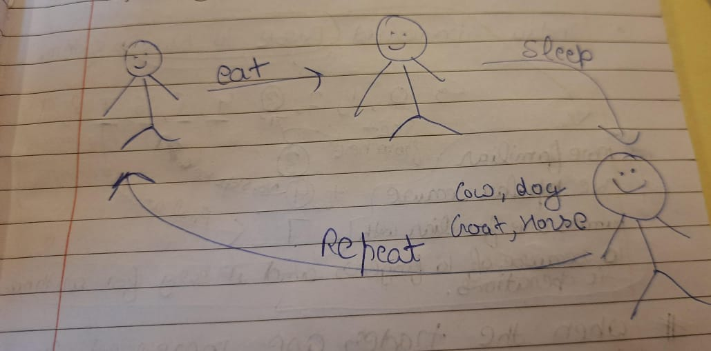
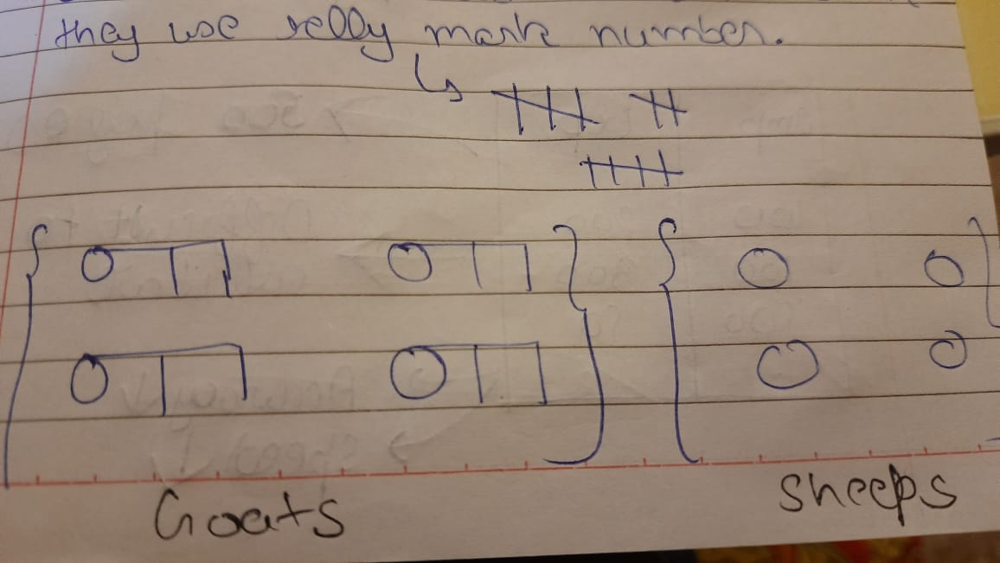
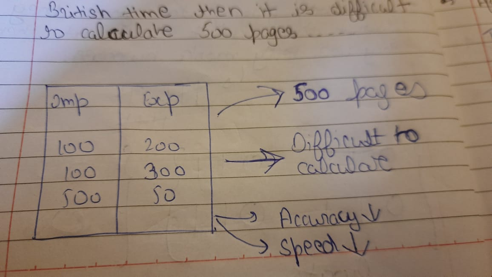
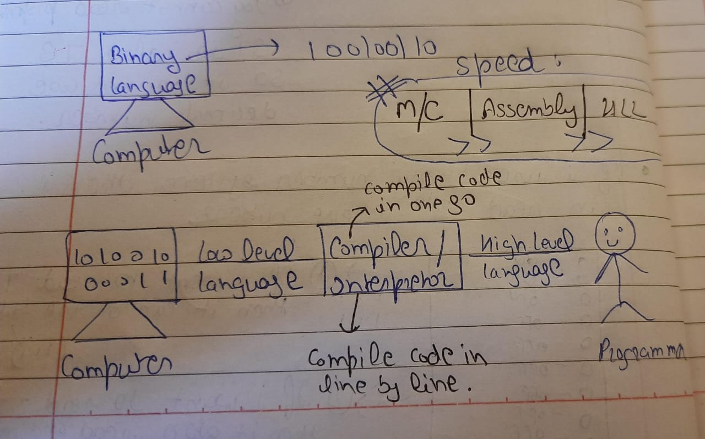

# Introduction To Programming:

**10,000 Years Ago:**

Humans are only do these activities that are: 
- Eat
- Sleep
- Repeat

They add some animals for their use like: Dog, Cow, Goats And Horse.

### Take Example:

When they went for grazing their animals then they notice that their animals are lost. At that time they don't know how to count so they use telly mark system:

**There Are Two Cases:**
- **Goats = Stones:** There is no loss
- **Goats < Stones:** There is loss

### After Some Number Systems Are Invented:

- **Base 60:** It is invented By Egypt
- **Base 10:** It is invented By India

Base 10 number system is more popular because humans are familiar then 10 number because of their daily life activities, they have 10 fingers and it is easy to arithmatic operation in base 10 number system.

## In Bristish Rule:

Trades are increases in import and export. At that time it is difficult to calculate the 500 pages or more. It is more they have error in calculatiuon at that time.

**After some time they invented computer.**

At that computer means **To Calculate**

### First Computer That Is Mechanical Computer:

Size of this computer is around a room. At that time accuracy came but it is also not soo fast.

## After 100 years Ago:

Transistors are invented and it changes the technology.

**Transistors:** A transistor is a miniature semiconductor that regulates or controls current or voltage flow in addition amplifying and generating these electrical signals and acting as a switch/gate for them.

At that time new number system is invented that are: **Binary Number System** with base 2.

**There are two case:**

- 0 or OFF 
- 1 or ON

## Number Systems:

- **Binary Number System:**

     - Base 2: 0,1

- **Decimal Number System:**
      
    - Base 10: 0,1,2,3,4,5,6,7,8,9

- **Ocatl Number System:**

  - Base 8: 0,1,2,3,4,5,6,7

- **Hexadecimal Number System:**

   - Base 16: 0,1,2,3,4,5,6,7,8,9,A,B,C,D,E,F

## Conversion:

## How Transistor Works:

If we use decimal number in transistor then it can only read 10 unique numbers.

If we use binary number in transistor then it can only read 2^10 unique numbers.

## Moore's Law:

Every 2 years transitor size is decrease and capacity is increase.

### About Computer:

Computer can only understand the binary language.

